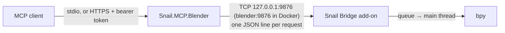

# Snail.MCP.Blender

An MCP server that lets an AI agent drive a running Blender: 149 tools for the scene, modeling,
materials, animation, physics, rendering, video editing and file exchange, reached through a small add-on inside Blender.



The server speaks MCP to the client and a one-line JSON protocol to the add-on. The add-on accepts the
connection on a background thread and runs every command that changes the scene on Blender's main thread, the only place
`bpy` may be touched; `ping`, `progress`, the file transfers and the storage commands leave the scene alone and are
answered on the socket thread. A Blender on another machine is reached the same way, through an SSH tunnel the server keeps open for
as long as it runs — see [Blender on another machine](remote.md). Or both run in Docker on a GPU machine, and clients
connect to the server over HTTPS — see [Blender in Docker](docker.md).

## Four layers of tools

1. **Always on** — the scene, objects, camera, lights, collections, files, projects and undo; the journal, leases, batches
   and snapshots; finding a tool by intent and moving files to and from a Blender elsewhere; plus the generic tools:
   any Blender operator with its properties validated, the operator's documentation, and Python.
2. **Skills** — `modeling`, `materials`, `animation`, `rendering`, `post`, `farm`, `io`, `physics` and `video`:
   107 dedicated tools in nine groups, loaded with `blender_enable_skill` and staying loaded until
   `blender_disable_skill`, or until unused for `SNAIL_MCP_BLENDER_SKILL_IDLE_MINUTES` when that is set. A server over HTTP
   gives every client that names itself a tool list of its own, so a skill one loads is not loaded for the rest. The always-on catalog stays at 42 tools, small enough for a model to choose from.
   Because the tool list holds only the loaded skills, `blender_find_tool` searches the whole catalog by
   what you are trying to do and opens the skill the match lives in.
3. **Sequences** — `blender_run` sends a list of commands to the open Blender in one call, so a build of
   hundreds of steps costs one round trip and every step still passes validation, the lease guard and the
   journal. This is what a repetitive build uses instead of a script.
4. **Python** — `blender_python` runs any code inside Blender when none of the three reaches the API.
   It skips validation and leases, and the journal records only that a script ran, so its reply names the tools that
   already do the same work,
   and a server configured with `SNAIL_MCP_BLENDER_PYTHON=fallback` refuses a script the tools could do.

## Quick start

```bash
dotnet tool install -g Snail.MCP.Blender
```

```json
{
  "mcpServers": {
    "blender": {
      "command": "snail-mcp-blender"
    }
  }
}
```

Then ask the agent to run `blender_install_addon`, install the zip it names in Blender
(**Edit → Preferences → Get Extensions → Install from Disk**), and check the **Snail** tab in the 3D
viewport sidebar: it says *listening on port 9876*. From there, ask in plain words. A server in Docker is registered by
its address with a bearer token instead, and needs nothing installed on the client — see [Blender in Docker](docker.md).

## Where to go next

- [Installation](installation.md) — prerequisites, the three ways to install, the add-on, verification.
- [Tools](tools/index.md) — all tools with parameters and JSON schemas, generated from the server itself.
- [Architecture](architecture.md) — the bridge protocol, main-thread execution, skills, resources.
- [Configuration](configuration.md) — environment variables, the token, the optional settings file.
- [Blender on another machine](remote.md) — a workstation or a GPU server, the tunnel, the Windows service.
- [Blender in Docker](docker.md) — both in containers on a GPU machine, clients over HTTPS, the pages for the volume.
- [Working with a local and a remote Blender](workflow.md) — which Blender is in use, where projects and renders live.
- [Prompts](prompts.md) — the three pipelines the server hands the model on request.
- [Several agents](agents.md) — journal, leases and batches when more than one agent shares a Blender.
- [Troubleshooting](troubleshooting.md) — what to do when a tool answers that the add-on is not answering.
